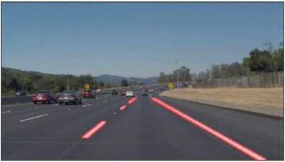
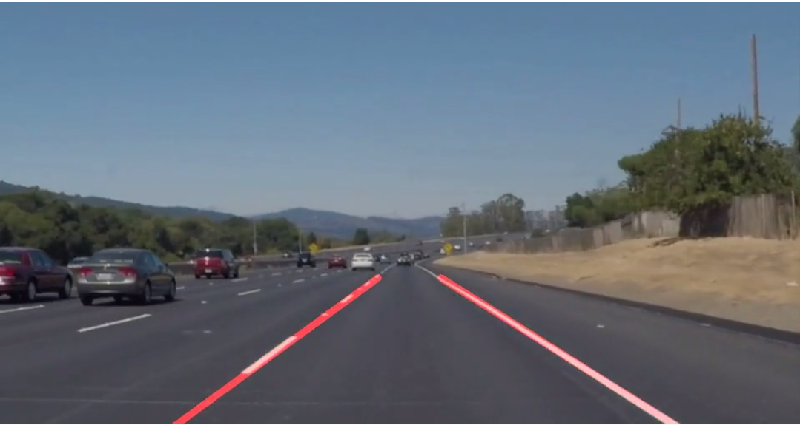
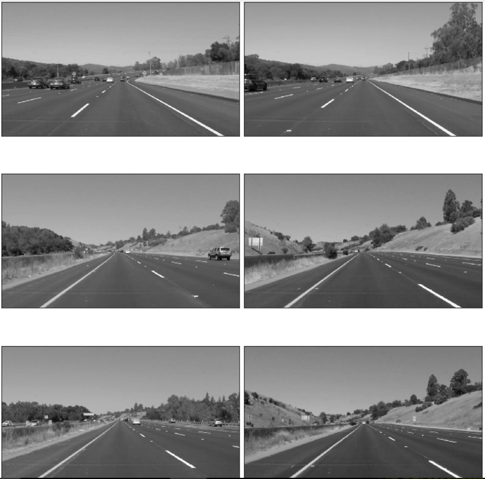
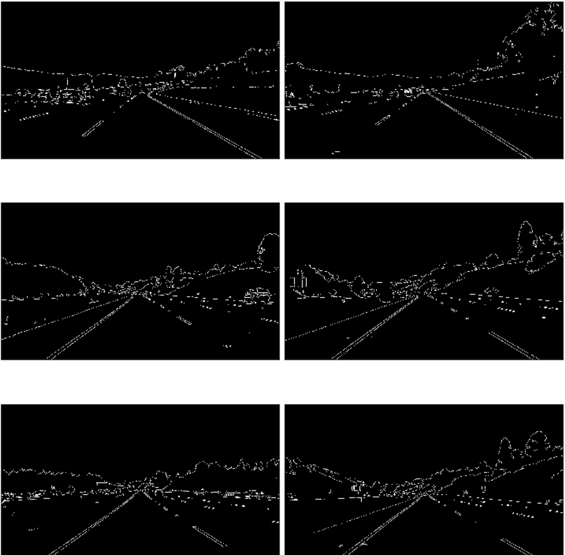
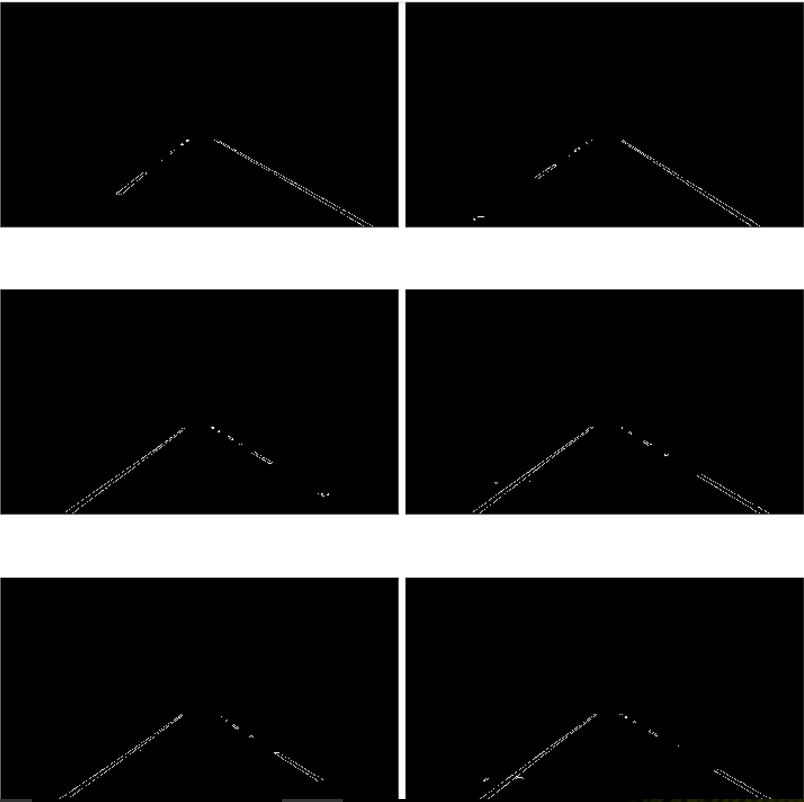
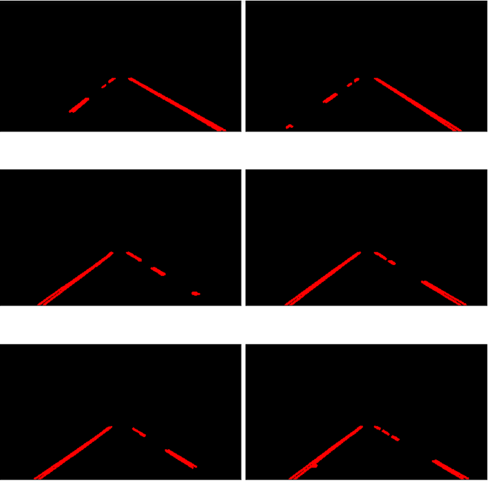
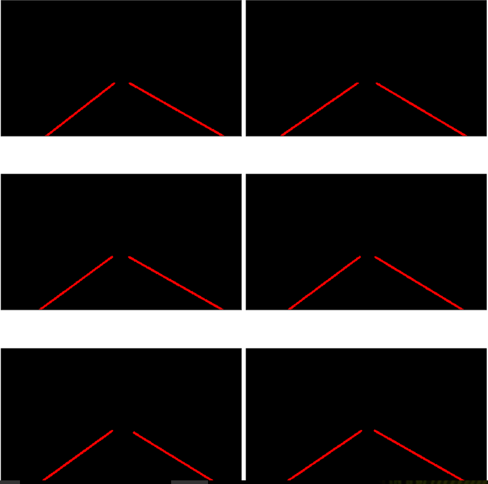
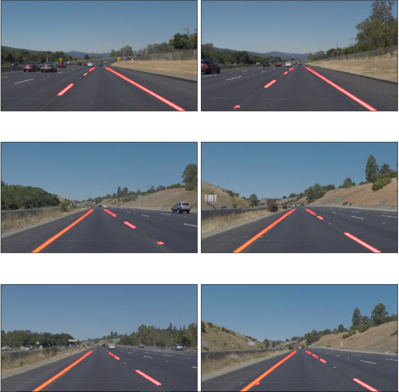

**Finding Lane Lines on the Road**

**Goal:**

The goal of this project is to find lane lines on road in a video. In
this project, I used python3 and OpenCV to process images and identify
lanes. Following images show the output of this project, image A is a
given natural image as input and image C is the final image output after
applying image pipeline mentioned in next section.

1.  Plain Image

B) Lanes edges marked with red lines

1.  Lanes edges marked with single solid line

**Steps/Pipeline:**

Each image will go through pipeline of image processing to detect lane
edges. My pipeline consists of 7 steps

1.  Convert image to gray scale

2.  Smooth image using Gaussian blur

3.  Edge detection using Canny Edge Detector

4.  Identify region of interest

5.  Detect lines using Hough transform

6.  Draw detected lines on original image

### **Reflection:**

1.  **Pipeline Description:**

<!-- -->

1.  **Image to gray scale:**

    First step in pipeline is to convert given image into gray scale
    image which helps in detection of edges as intensity change is
    easily identified in gray scale image.

    *cv2.cvtColor(image, cv2.COLOR\_RGB2GRAY)*

    

2.  **Apply smoothing:**

    In next step, we apply smoothing to remove noise from the image. In
    this project, I used gaussian blur with kernel size 5 to smooth
    input images.

    *cv2.GaussianBlur(image, (kernel\_size, kernel\_size), 0)*

3.  **Edge Detection: **

    Detecting edges in image will help to identify lanes. In this
    project, I used Canny edge detector which uses image intensity
    gradients to identify edges. This function takes two parameters high
    threshold, low threshold.

    If intensity gradient is more than high threshold it is marked as
    strong edge and if between high and low threshold they
    are connected.

    As per recommendations, low and high thresholds are in ratio of 1:3
    or 1:2. In my project I used 50, 150 as thresholds.

    *cv2.Canny(image, low\_threshold, high\_threshold)*

    

4.  **Identify region of interest: **

    In the image, we can see many lanes but we should focus on lines
    which we are in. So, we use a quadrilateral mask to identify region
    of interest. Any pixels outside of region of interest are marked
    as black.

    *cv2.fillPoly(mask, vertices, ignore\_mask\_color)*

    

5.  **Line Detection: **

    I used Hough transform to detect lines in the image. Hough transform
    transfers all pixels into parameter space and detect lines by
    identifying intersecting lines in parameter space.

    *lines = cv2.HoughLinesP(img, rho, theta, threshold, np.array(\[\]),
    minLineLength=min\_line\_len, maxLineGap=max\_line\_gap)*

    *cv2.line(img, (x1, y1), (x2, y2), color, thickness)*

    

    **Solid line from line detection: **

    Instead of detecting multiple lines to detect a single solid line, I
    modified draw\_lines() function to calculate slope and intercept for
    left lane and right line by averaging all slopes and intercepts of
    lines identified in Hough transform. I used these slope and
    intercept values to create a single solid line for both left and
    right lanes.

    

6.  **Draw Lines:** We can overlap original image and lanes lines image
    to visualize identified lanes on original image.

    *cv2.addWeighted(initial\_img, α, img, β, λ)*

    

### **Potential shortcomings with current pipeline:**

-   Identifying lanes based on above approach is good when image is
    clean and clear. In real world, images are not as good as given in
    this project. We may encounter multiple problems like snow, rain,
    shades on road which causes problem to identify lanes.

-   We are fixing parameters to our image processing methods like region
    of interest, edge and line detection. These parameters might not be
    suitable to all scenarios like mentioned above making lane
    detection hard.

-   Averaging lines identified in Hough transform to calculate slope,
    intercept is not suitable in other scenarios like curved roads.

### **Possible improvements to pipeline:**

-   Instead of setting parameters manually, we can use machine learning
    based models \[Object segmentation\] to identify lanes in images.

-   In above pipeline, we can try and use converting images into
    different color spaces like HSV and HLV to improve edge detection
    and it is affecting lane detection.

-   We can try use different methods for identifying solid line instead
    of averaging slopes, we can take weighted average based on lengths
    of lines and see how it is affecting output.

